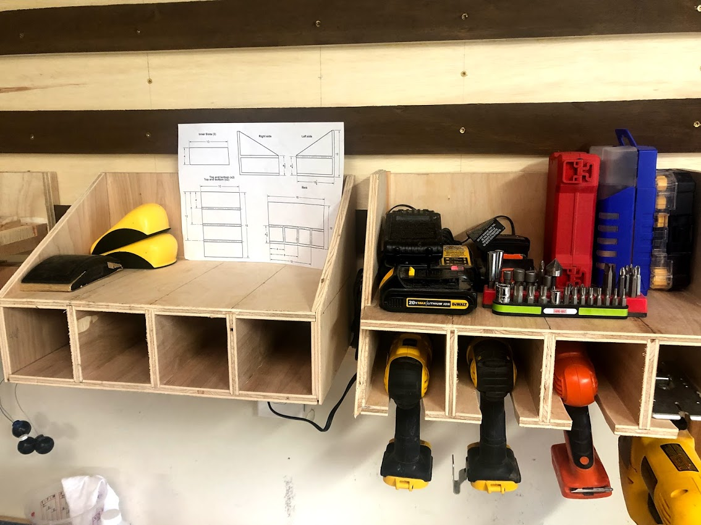

# Fusion 360 Tool Shelf

This project contains a Fusion 360 project file to create a simple shelf that has drawers on the bottom and a flat shelf on top. 

The project assumes you will be building with 1/2" plywood. However, you can adjust the plywood thickness, as well as all other key dimensions (depth, height, width, number of slots) and the project will auto-update. 

This project was inspired by seeing lots of similar shelves available on Etsy, [such as this one](https://www.etsy.com/listing/917846047/cnc-made-cordless-drill-organizer-wall?ref=landingpage_similar_listing_top-4&pro=1&frs=1). These existing options look well-made, but given that I have a woodshop, I wanted to build my own. 

## Examples

Here's the realworld output :)

You can easily adjust the size and number of slots on the lower shelf by changing the project parameters:

For example, the screenshot below shows what it looks like to add an extra slot, increase the plywood thickness to 3/4", and make our top shelf a bit shorter: 

And this is what the modified parameters look like for the shelf above: 

## Drawings

The drawings I provide below will make a shelf with four 3.5"x3.5" bottom slots, each with 10" deep of usable space. The upper shelf will have 6" of exposed panel on the back. 

The material is assumed to all be 1/2" plywood, with 1/4" dado slots cut to fit pieces together. 

### Bottom and top panels

The bottom and top panels are mirror images of one another. Note that the two outer-most dados are 3 3/4" away from the left and right edges, whereas the inner dados are 3 1/2" from one-another. 

This is because the two outer-most edges of the top and bottom will be inserted 1/4" into dados in the left and right sides, which brings the final usable width of the outer slots to the same 3 1/2" as the inner slots. 

The 4", 8", and 12" measurements on the right show the centerline of the 1/2" dados that need to be cut. 

### Slot inserts

These slot inserts are the vertical walls that define the bottom inner shelves. A total of three will be needed. 

### Back

The back of the shelf is similar to the front in that it will have a series of dados into which you will insert the back edges of the top, bottom, and slot insert panels: 

### Left and right sides

The image below is the left side of the shelf. The right side would of course be the mirror image of this: 

